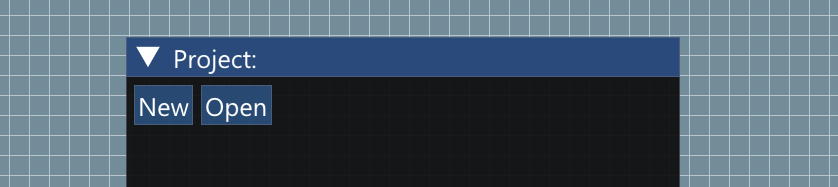
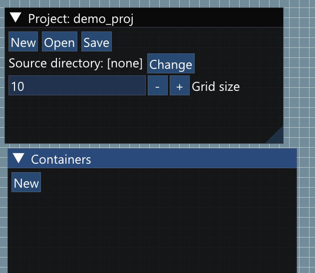
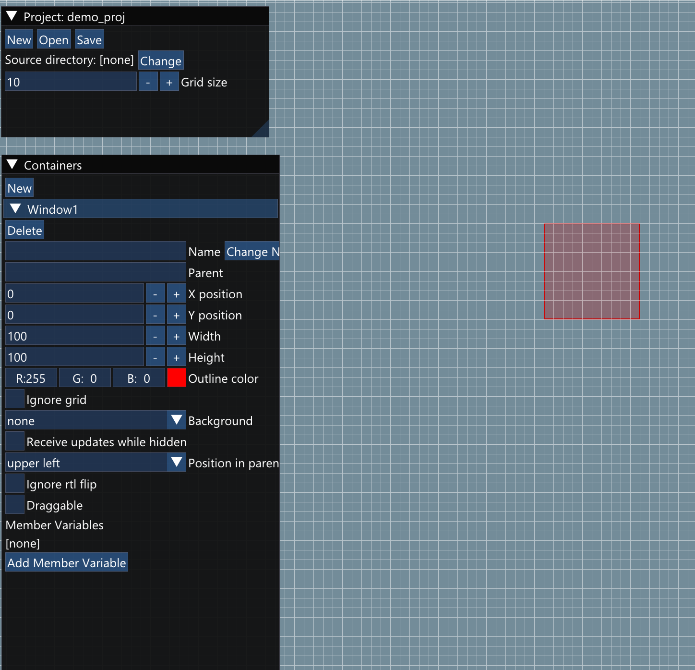
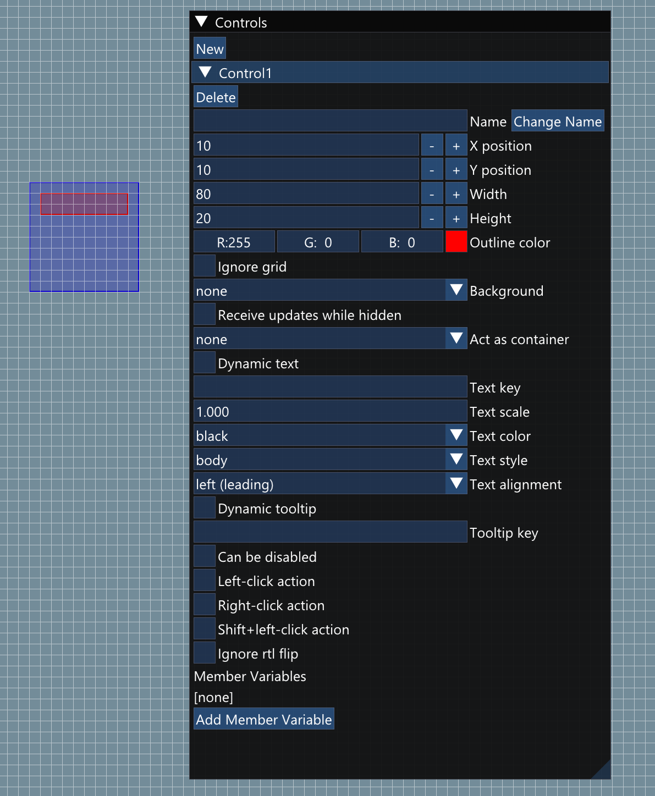

# Project Alice UI Editor

## Introduction

The ui editor works directly with `.aui` files. All `.aui` files present in the assets directory are loaded by Project Alice at runtime to provide the information required to display UI elements, such as where they are positioned, which textures they use, and so on. The ui editor *also* generates a `.cpp` file from this information that contains a substantial amount of boiler-plate code for setting up the ui described in the `.aui` file along with marked locations where you can add additional code to control the behavior of ui elements. Most purely visual changes can be accomplished by editing the `.aui` file (and thus are moddable), but behavior changes require recompilation of the associated `.cpp` file.

## Getting started

When you first open the ui editor you will be presented with a single floating window containing just two button, "New" and "Open". Both buttons will bring up the standard file-picker dialogue to pick either a new `.aui` file (or overwrite an existing one) or open an existing project file.

All project files should be created in the assets directory. For most of us, the directory we do our work in is inside our local copy of the repository and is not the assets directory of our Victoria 2 installation, which is annoying because this requires constantly copying edited `.aui` files into the Victoria 2 directory for them to show up in game. To save yourself that nuisance (or worse, forgetting to do it and trying to debug why the change you made isn't showing up in game), I suggest running `mklink /d "C:\programs\V2\assets" "C:\VSProjects\Project-Alice\assets"` (with your directories, not mine). This command creates a link to the repository directory (the second directory) that functions as if it was the assets directory inside your Victoria 2 folder, which means that you won't have to copy files back and forth any more.

Once you create a new project, a new floating window labeled "Containers" will appear as well as some new options in the project window. To start with, you should tell the editor where the source directory for your project will be. Unless you have a good reason to pick something else, choose the `src\gui` directory in the repository. This is the directory that the generated `.cpp` file will eventually appear in. Then, you should choose your grid size. The grid for a project does two things. First, it provides a handy way to line up elements and size them consistently. Second, and more importantly, it controls the default text size. Within a project, text is scaled so that a `1.0` size line of text is exactly two grid units high (note: the entire line, not just the height of the capital letters). For the macro builder, I chose a grid size of 9, which results in very readable text, if a little on the large size. For denser windows you might want to pick a grid size of 8 or 7. Generally you will make buttons with text either 3 grid units high, if their button image uses most of the available space, or 4 grid units high if their button image has significant padding around it.

Once that is taken care of, save your project. (Save early and often, because the editor is still in the early stages of development and may have bugs.) Note that no changes are made to your project file until you click save. This could cause you to lose your work if you close without saving, but it could also be useful, since there is currently no undo feature (edit carefully).

## Containers

Now we can look at the containers window. This window lists all the window-like things in your project. A window-like thing is a collection of controls that are all displayed together and which have a common coordinate system. Top level windows are a container, but so are the items that define a single line in a list or a single entry in a grid. Since a new project has no containers, the only possible thing to do is click the `New` button to create a new container.

Once your project has a container, it will appear in the `Containers` window, where you can set its properties. Right now it has only a few default properties set and appears as a mostly transparent red rectangle. You can resize and move the window by moving and resizing the window's visible rectangle. You can also zoom in and out with the scroll wheel, but this is merely for your convenience and does not affect the actual size of the container.

### Container options

- The delete button: removes the container and all controls in it from the project. Use with caution.
- Name / change name button: pressing the `Change Name` button will change the name of the container to be the entered text. Each container in a project must have a unique name, and that name *must* be a valid C++ identifier (so no spaces or hyphens, for example).
- The parent field: this is mostly diagnostic and will probably be removed as soon as I remember to do so.
- X position, Y position, Width, Height: Allow you to control the position and size of the window numerically.
- Outline color: This controls the color of the rectangle that is used to indicate the container in the editor. It has no effect on anything in game.
- Ignore grid: Allows you to move and resize the container without it snapping to the gird. Note that the grid size still determines base text size, even if ignore grid is enabled. Like outline color, this has no effect on anything in game.
- Background: Determines the appearance of the control in game. If "no background" is selected, then the container itself will not be rendered at all and will not intercept mouse clicks (controls within the container will still function, however). If "texture" is selected you may pick any image from the assets directory (note: it must be in assets directory) to use as the background of the container. It will be stretched to fit the size of the container if necessary. "bordered texture" functions as "texture" except that a border size option also appears. For such a container, the defined border region is not stretched into the interior in order to fill the space. In practice, this can be used with a texture that contains a fixed size frame to allow that same frame to be used in many different windows with minimal distortion. Finally, there is the "legacy gfx" option. With it selected you can name any element found in the Victoria 2 ".gfx" files and it will be used, if possible, as the background of the container. (The primary use for this is for sprite strips such as the commodity and unit icons). The generated object will have a `frame` member variable that can be used to control which frame is rendered from a sprite strip.
- Alternate texture: This checkbox only appears if the container has a texture or bordered texture background (and so is not pictured in the screenshot). If selected, you will be able to pick a *second* texture for the background, and the generated object will have a `bool` `is_active` member variable. When that variable is `true`, the window will be rendered using the provided alternate texture instead of the normal texture. (This can be used for things like check boxes and or a control that can be selected.)
- Receive updates while hidden: Generally, ui elements in Project Alice do not receive `on_update` notifications when they are not visible, which can be awkward if you want to make a control or window that can become visible again based on changing conditions. With this check box ticked, the control will continue to receive `on_update` notifications even when it is hidden.
- Position in parent control: Determines how the local coordinate system for the container is mapped into that of its parent. (Consult the implementation in Project Alice for details.) Note that, if something other than upper left is chosen, usually you want to make at least one of the X or Y positions negative.
- Ignore RTL flip: Normally, when an RTL locale is selected all images are flipped horizontally. Checking this option exempts the background of this container from that. This should be used extremely rarely, if ever.
- Draggable: If selected it will be possible for the container to be re-positioned by clicking on it and dragging it to a new location.
- Member variables: One or more data items can be added to a container, making them visible from all controls within the container. Generally, any ui state for the container should be placed here. Note that a container that defines a row for a list or an item for a grid *must* have at least one member variable named `value`.

## Controls

Once you have created a container, you can add controls to it. A "control" is the generic term used in this document for any item found inside a container, and includes non-interactable icons and labels in addition to things like buttons. The `New` button at the top of the `Controls` window adds a new control to the currently selected container, and the list of options for that control will become visible.

### Control options

- The delete button: removes the control from the window. All associated options will be lost.
- Move up and move down buttons: (not visible in the image) Controls can be moved up or down in the rendering order. The first control in the list is rendered first (will be on the bottom) with controls later in the list appearing on top of it.
- Name / change name ... receive updates while hidden: these options function the same way as they do for containers, so consult the previous section.
- Act as container: This allows you to create a control that functions as a list or as a grid view. (A list stacks its contents vertically on top of each other, while a grid view uses both the horizontal and the vertical space.) If the control is acting as a container you must also name another container within the project. That container will be used as a template to instantiate the individual items within the list or grid. You will also be asked to specify the list content. This is the C++ data type that will be internally stored in the list. The container that you pick as the child must have a member variable of that type named `value`.
- Dynamic text: When selected this causes the element to have the ability to display text, but no default text will be provided. Instead you will have to call the generated `set_text` member function either during creation or in the update function to provide the control with text.
- Text key: If dynamic text is not selected, you can provide a text key and the control will display text using the named csv key.
- Text scale: This controls the size of the text. As already mentioned, the size of a line of text is controlled by the grid size and is two gird units tall at 1.0 scale.
- Text color: This determines the default color of the displayed text. Text color may be controlled dynamically by changing the `text_color` member of the generated object.
- Text style: This controls the font that the text is rendered with. Currently the only choices are between the font we use to render headers (with small caps) and the font we use for body text.
- Text alignment: This controls how the text will be arranged within the box that defines the control.
- Dynamic tooltip: If this option is selected, the control will have a tooltip, but you must provide the contents by providing the body of the tooltip update function for the generated object.
- Tooltip key: If a tooltip key is provided, the control will have a tooltip that display the (fixed) text corresponding the the provided csv key.
- Can be disabled: If this option is selected, the generated object will have a boolean `disabled` member variable, and when this member is set to `true` the control will render using the black and white disabled filter and will not respond to mouse events.
- Left-click action, Right-click action, Shift+left-click action: Selecting one or more of these options will allow you to insert code into the generated object to respond to mouse events. It also makes the control opaque to mouse events. If none of these are defined, the mouse events will "fall through" to the control underneath, if any.
 -Ignore RTL flip ... Member variables: function the same as they do for containers.

## `.cpp` file generation

As mentioned in the introduction, to attach behavior to the ui you have designed you will need to generate a `.cpp` file using the `Generate` button in the project window. Clicking that button will create a new `.cpp` file in the chosen source directory with the same name as your project. Now, if this is existing project, you may very well have generated the `.cpp` file on a previous occasion and already added some code to it. Assuming there are no bugs in the editor, code that you have added to the file previously will not be lost as long as you have put it between the provided `// BEGIN ...` and `// END` comments. Any code that is between such comments in the existing file will be saved and then reinserted back into the regenerated file. If the generator cannot determine where a code section should go, it will be saved in the new generated file at the end as a commented block following the comment `// LOST CODE`.

In general, an empty `// BEGIN` and `// END` section will be created for each control whenever it would make sense given the properties that the control has. All controls and containers have such a section on their `on_create` function that can be used to give initial values to any member variables. All controls and containers also have an `on_update` function and a place to put user code in it.

### Integrating a new `.cpp` file

The first time that you generate a new `.cpp` file, you should add it an an *include* to the existing `src/alice_ui.cpp`. This file acts as a miniature unity build for the user interface and it is optimized so that changes you make to the generated files to alter ui behavior will have fast rebuilds, allowing you to quickly iterate and experiment with ui. You should also add a prototype for the factory function for any containers you want to expose to the rest of the program to `src/alice_ui.cpp`. Those function calls always have the form `std::unique_ptr<ui::element_base> make_𝑝𝑟𝑜𝑗𝑒𝑐𝑡-𝑛𝑎𝑚𝑒_𝑐𝑜𝑛𝑡𝑎𝑖𝑛𝑒𝑟-𝑛𝑎𝑚𝑒(sys::state& state);` and are the only interface the rest of the program has to the types that are generated for your ui.

### Member variables

As noted in previous sections, controls and containers can have member variables. Naturally, this means that a control can access its own variables in its functions. For convenience, a reference to the containing window, and to that window's parent (if it is known) are also generated before each place where you might insert your own code so that you can refer to the variables of a containing window from any controls in it without undue effort. But, there is an exception to this. You cannot access the variables of a containing object from within an `on_create` function, since those functions are called as part of control creation, and before they are inserted into the containing object.

### Lists and grid views

Lists and grids each contain a member called "values" that stores the contents of all the things in the list or grid. Altering the contents of this vector alters what is displayed in the list (although you will need to ensure that the ui is then updated after your change is made for it to be displayed). And at any given time, only a small range of those values are displayed, which are referred to as the current page. To change the displayed page, you should call the control's `change_page` method. You can also call `max_page` to get the (zero based) number of the last page with content.

### Get by name

Part of the optimization for faster builds after changes to ui code is not allowing their types to leak out of the generated files. Of course, you may still need to alter the values contained in those objects. To facilitate this, a new virtual function has been added to the base element interface:
`void* get_by_name(sys::state& state, std::string_view name) noexcept;`
If you pass the name of one of the data members of a generated object to this function it will return a pointer to that member. An object without a data member with that name will return `nullptr`. However, there is absolutely no type safety when using this function, so calling it on the wrong object could easily result in memory corruption or other errors when you attempt to write to a value of the wrong type. Use with the appropriate amount of caution.